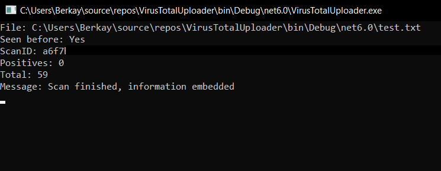
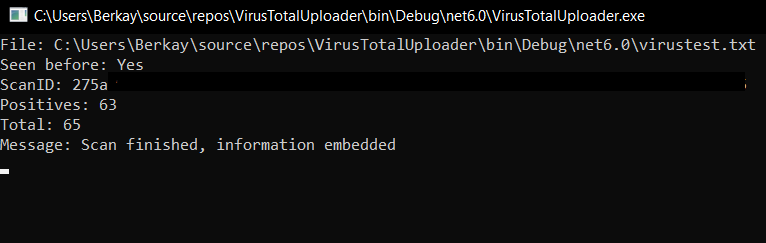

# VirusTotalUploader

Hi! I'm **Berkay**. I'm a first year student at Marmara University, Department of Electrical and Electronics Engineering. If you want to learn about _VirusTotalUploader_, you can read me.

## What are Computer Viruses?
###  Computer Virus Definition
Chances are you’ve heard how important it is to keep viruses out, but what is a computer virus exactly? A computer virus is a type of malicious software, or malware, that spreads between computers and causes damage to data and software.

Computer viruses aim to disrupt systems, cause major operational issues, and result in data loss and leakage. A key thing to know about computer viruses is that they are designed to spread across programs and systems. Computer viruses typically attach to an executable host file, which results in their viral codes executing when a file is opened. The code then spreads from the document or software it is attached to via networks, drives, file-sharing programs, or infected email attachments.

>If you want to know more about viruses, you can browse [this website](https://www.fortinet.com/resources/cyberglossary/computer-virus).

## What is VirusTotalUploader
With the spread of technology recently, malicious people have often use computer viruses. For this reason, many antivirus programs have been developed. VirusTotalUploader is the one of these softwares. My aim while coding this program was to scan files locally and detect and print viruses inside. Firstly checks whether the file you want to scan has been scanned, then prints how many viruses are in the file as in the examples.

##### Clean result

##### Infected result 

